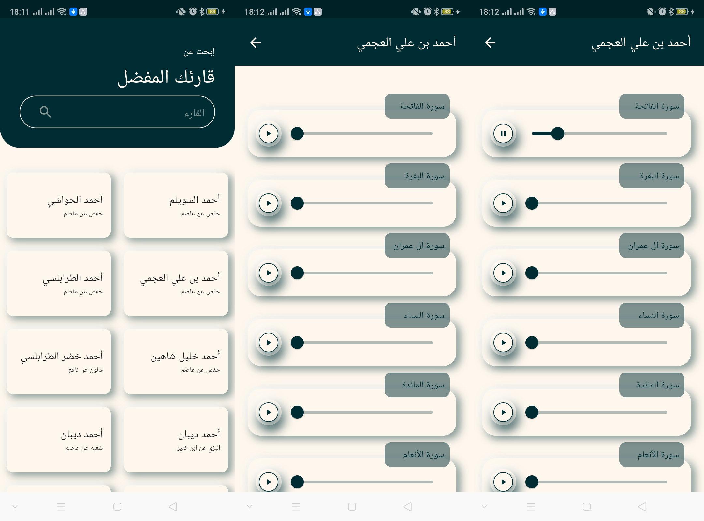

# quran_mp3

#تطبيق القران الكريم
يمكنك من خلال هذا التطبيق الاستماع الي القران الكريم بصوت العديد من القراء

Flutter Quran App with Clean Architecture and BLoC

1. Clean Architecture Using BLoC:
Leverage the power of clean architecture and BLoC (Business Logic Component) for robust state management, ensuring a modular and maintainable codebase.

2. Fetch Data from JSON File:
Effortlessly retrieve Quranic data from a local JSON file, providing users with a seamless and efficient browsing experience.

3. Load URL Using just_audio:
Enhance the audio playback experience by incorporating the just_audio package to load audio URLs, ensuring a smooth and high-quality Quranic recitation.

4. App Explanation:
Immerse yourself in a simple yet powerful Flutter app designed to explore and listen to Quranic recitations. Utilizing clean architecture and BLoC for state management, the app seamlessly fetches data from a JSON file, allowing users to browse reciters and Surahs effortlessly. The integration of just_audio enhances the audio playback, providing an immersive experience for users on their Quranic journey.

Screenshots:

